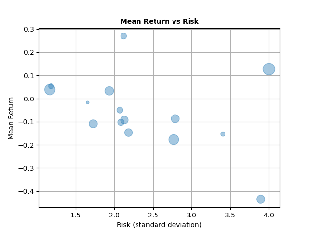

Median:
shape: (1, 15)
┌───────────┬──────────┬───────────┬───────────┬───┬───────────┬───────────┬───────────┬───────────┐
│ JPM       ┆ XOM      ┆ CRM       ┆ AMZN      ┆ … ┆ NKE       ┆ SBUX      ┆ T         ┆ KO        │
│ ---       ┆ ---      ┆ ---       ┆ ---       ┆   ┆ ---       ┆ ---       ┆ ---       ┆ ---       │
│ f64       ┆ f64      ┆ f64       ┆ f64       ┆   ┆ f64       ┆ f64       ┆ f64       ┆ f64       │
╞═══════════╪══════════╪═══════════╪═══════════╪═══╪═══════════╪═══════════╪═══════════╪═══════════╡
│ 139.21747 ┆ 78.50219 ┆ 211.01499 ┆ 153.89325 ┆ … ┆ 135.65210 ┆ 89.979958 ┆ 18.389999 ┆ 59.691797 │
│ 6         ┆          ┆ 9         ┆           ┆   ┆ 7         ┆           ┆           ┆           │
└───────────┴──────────┴───────────┴───────────┴───┴───────────┴───────────┴───────────┴───────────┘

Descriptive Statistics:
shape: (9, 16)
┌───────────┬───────────┬───────────┬───────────┬───┬───────────┬───────────┬───────────┬──────────┐
│ statistic ┆ JPM       ┆ XOM       ┆ CRM       ┆ … ┆ NKE       ┆ SBUX      ┆ T         ┆ KO       │
│ ---       ┆ ---       ┆ ---       ┆ ---       ┆   ┆ ---       ┆ ---       ┆ ---       ┆ ---      │
│ str       ┆ f64       ┆ f64       ┆ f64       ┆   ┆ f64       ┆ f64       ┆ f64       ┆ f64      │
╞═══════════╪═══════════╪═══════════╪═══════════╪═══╪═══════════╪═══════════╪═══════════╪══════════╡
│ count     ┆ 252.0     ┆ 252.0     ┆ 252.0     ┆ … ┆ 252.0     ┆ 252.0     ┆ 252.0     ┆ 252.0    │
│ null_coun ┆ 0.0       ┆ 0.0       ┆ 0.0       ┆ … ┆ 0.0       ┆ 0.0       ┆ 0.0       ┆ 0.0      │
│ t         ┆           ┆           ┆           ┆   ┆           ┆           ┆           ┆          │
│ mean      ┆ 139.34575 ┆ 75.71046  ┆ 220.20384 ┆ … ┆ 136.49381 ┆ 93.284731 ┆ 18.572554 ┆ 58.97344 │
│           ┆ 9         ┆           ┆ 9         ┆   ┆ 4         ┆           ┆           ┆ 9        │
│ std       ┆ 18.900877 ┆ 14.255036 ┆ 45.921136 ┆ … ┆ 22.269809 ┆ 14.76279  ┆ 1.213985  ┆ 4.082618 │
│ min       ┆ 108.0     ┆ 51.318935 ┆ 155.60000 ┆ … ┆ 100.89020 ┆ 69.175858 ┆ 15.860222 ┆ 50.92875 │
│           ┆           ┆           ┆ 6         ┆   ┆ 5         ┆           ┆           ┆ 3        │
│ 25%       ┆ 120.79151 ┆ 61.093651 ┆ 181.30999 ┆ … ┆ 114.15211 ┆ 79.661835 ┆ 17.67112  ┆ 54.83067 │
│           ┆ 9         ┆           ┆ 8         ┆   ┆ 5         ┆           ┆           ┆ 3        │
│ 50%       ┆ 139.52250 ┆ 78.632698 ┆ 211.02999 ┆ … ┆ 135.79104 ┆ 90.078697 ┆ 18.389999 ┆ 59.70647 │
│           ┆ 7         ┆           ┆ 9         ┆   ┆ 6         ┆           ┆           ┆          │
│ 75%       ┆ 156.00201 ┆ 86.707535 ┆ 259.17001 ┆ … ┆ 157.27186 ┆ 109.42915 ┆ 19.263426 ┆ 62.45465 │
│           ┆ 4         ┆           ┆ 3         ┆   ┆ 6         ┆ 3         ┆           ┆ 5        │
│ max       ┆ 168.01387 ┆ 103.58354 ┆ 309.95999 ┆ … ┆ 175.8461  ┆ 116.73616 ┆ 21.039766 ┆ 65.25927 │
│           ┆           ┆ 9         ┆ 1         ┆   ┆           ┆           ┆           ┆ 7        │
└───────────┴───────────┴───────────┴───────────┴───┴───────────┴───────────┴───────────┴──────────┘

